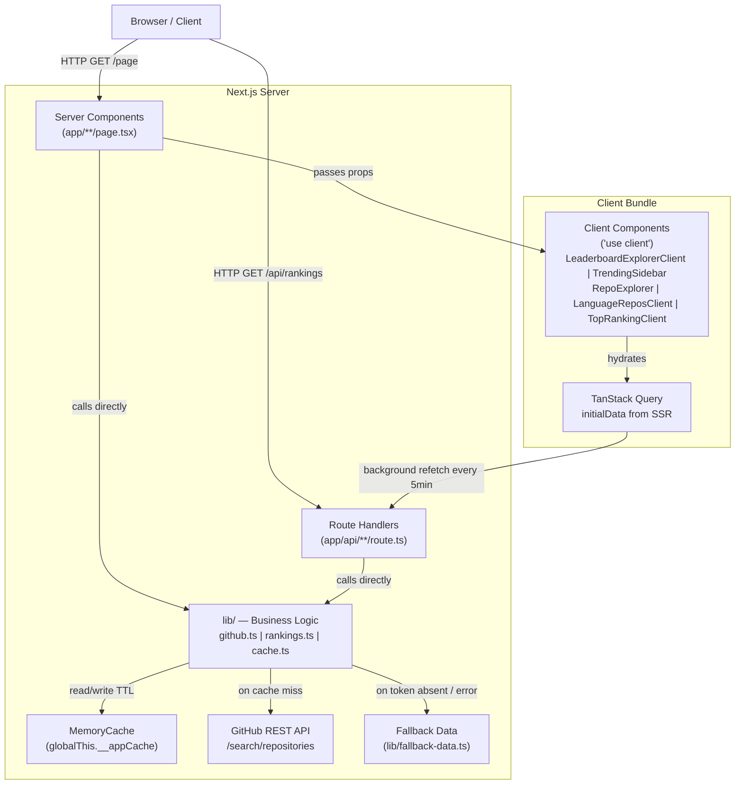

# Architecture Blueprint

> Generated: 2026-04-21

---

## 1. Architectural Overview

**Pattern**: Layered Monolith with React Server Components (RSC) boundary

**Guiding principles**:
- Server Components own all data fetching — no API round-trips from RSC to own Route Handlers
- Client Components handle only interactivity (hooks, event handlers, browser APIs)
- Single in-process cache eliminates database dependency for a read-only dashboard
- Fallback data ensures the app always renders even without a GitHub token

**Organizational approach**: By layer (`app/`, `components/`, `lib/`, `types/`) with clear dependency rules.

---

## 2. Component Diagram



---

## 3. Core Components

### `app/` — Routing & Pages

| File | Role |
|------|------|
| `layout.tsx` | Root layout — sets metadata, loads fonts, wraps in `QueryProvider` + `Header` + `Footer` |
| `page.tsx` | Leaderboard — renders `LeaderboardExplorerClient` |
| `language/[slug]/page.tsx` | Language detail — dynamic SSR, `notFound()` guard, passes data to `LanguageReposClient` |
| `top-ranking/page.tsx` | Top repos — SSR shell, delegates to `TopRankingClient` |
| `error.tsx` | App-level error boundary (Client Component) |
| `not-found.tsx` | 404 fallback |
| `loading.tsx` | Suspense skeleton per route |

### `components/` — Reusable UI

| Component | Type | Role |
|-----------|------|------|
| `Header.tsx` | Client | Sticky nav with active-link detection via `usePathname` |
| `Footer.tsx` | Server | Static footer |
| `QueryProvider.tsx` | Client | TanStack Query `QueryClient` singleton wrapper |
| `LeaderboardExplorerClient.tsx` | Client | Orchestrates two-panel layout; manages `selectedRepo` state and mobile drawer |
| `TrendingSidebar.tsx` | Client | Weekly/All-time/Random trending repos tabs; fetches `/api/trending-repos` |
| `RepoExplorer.tsx` | Client | Repo search autocomplete, star history `AreaChart`, release list |
| `TopRankingClient.tsx` | Client | Top repos tabs by type + pagination |
| `LanguageReposClient.tsx` | Client | Per-language repo list with TanStack Query fetch |
| `RankBadge.tsx` | Server | Medal badge (gold/silver/bronze/numeric) |
| `MetricBar.tsx` | Server | Horizontal progress bar for normalized scores |
| `SkeletonTable.tsx` | Server | Loading skeleton |

### `lib/` — Business Logic

| Module | Responsibility |
|--------|---------------|
| `github.ts` | GitHub API calls, concurrency limiter, in-flight deduplication, auth headers |
| `rankings.ts` | Min-max normalization, composite score, ranking sort, slug lookup, related language distance |
| `trending.ts` | Trending repos, repo releases, repo search, star history sampling |
| `cache.ts` | `MemoryCache` class with TTL; `globalThis` singleton for HMR safety |
| `errors.ts` | `AppError` hierarchy: `GitHubApiError`, `RateLimitError`, `NotFoundError` |
| `utils.ts` | `cn()`, `formatNumber()`, `formatRelativeTime()`, `toLanguageSlug()`, slug→name map |
| `fallback-data.ts` | Static demo metrics shown when no `GITHUB_TOKEN` |

### `types/` — Shared Types

`rankings.ts` owns all domain types: `LanguageMetrics`, `LanguageRanking`, `RankingResponse`, `NormalizedMetrics`, `SortMetric`, `TrendingMode`, `TrendingRepo`, `TrendingReposResponse`, `RepoRelease`, `RepoReleasesResponse`, `RepoSearchResult`, `StarDataPoint`, constants `COMPOSITE_WEIGHTS`, `MIN_REPO_THRESHOLD`, `LANGUAGE_CATEGORIES`.

---

## 4. Layers & Dependency Rules

```
types/          ← no imports (pure type definitions)
    ↑
lib/            ← imports from types/ only
    ↑
components/     ← imports from lib/ and types/
    ↑
app/            ← imports from lib/, types/, components/
```

**Enforced rules**:
- `lib/` never imports from `app/` or `components/`
- `types/` never imports from anywhere
- Server Components never call their own Route Handlers — they call `lib/` directly
- No circular dependencies present

---

## 5. Data Architecture

### Domain Model

```
LanguageMetrics (raw from GitHub)
  name: string
  slug: string
  repositoryCount: number
  starCount: number
  forkCount: number
  activityCount: number   ← repos pushed_at within 30 days (top 100)

NormalizedMetrics (0–100 min-max per dimension)
  repositories | stars | forks | activity

LanguageRanking (= LanguageMetrics + NormalizedMetrics + computed)
  rank: number
  compositeScore: number  ← weighted sum of normalized metrics
```

### Composite Score Formula

$$\text{score} = 0.25 \cdot \text{repos}_{norm} + 0.30 \cdot \text{stars}_{norm} + 0.20 \cdot \text{forks}_{norm} + 0.25 \cdot \text{activity}_{norm}$$

Tie-breaking: higher raw star count wins.

### Data Access Flow

```
Request
  → getRankings() [lib/rankings.ts]
    → getLanguageMetrics() [lib/github.ts]
      → appCache.get(CACHE_KEY)           // HIT: return immediately
      → withConcurrency(fetchTasks, 5)    // MISS: fetch 30 languages × top-100 repos
        → searchRepos(lang)               // GitHub /search/repositories
      → appCache.set(result, 5min TTL)
    → rankMetrics(metrics)                // normalize + score + sort
  → return RankingResponse
```

### Caching Strategy

| Layer | Mechanism | TTL |
|-------|-----------|-----|
| In-process (rankings) | `MemoryCache` (Map) | 5 minutes |
| In-process (trending) | `MemoryCache` (Map) | 10 minutes |
| In-process (releases) | `MemoryCache` (Map) | 15 minutes |
| In-process (star history) | `MemoryCache` (Map) | 30 minutes |
| HTTP (fetch) | `cache: 'no-store'` | Bypassed — managed manually |
| TanStack Query | client `staleTime` | 5 minutes |
| TanStack Query | client `gcTime` | 10 minutes |

---

## 6. Cross-Cutting Concerns

### Error Handling

```
AppError (base)
  ├── GitHubApiError  (code: GITHUB_API_ERROR, 503)
  ├── RateLimitError  (code: RATE_LIMIT, 429, resetAt: Date)
  └── NotFoundError   (code: NOT_FOUND, 404)
```

- Route Handlers: `try/catch` → structured `{ error: { code, message } }` JSON
- Server Components: `notFound()` for invalid slugs; fallback data for API failure
- Client Components: `isStale` prop triggers amber banner — no thrown errors visible to user

### Auth & Secrets
- No user authentication (public read-only dashboard)
- `GITHUB_TOKEN` in `.env.local` (not committed) — optional but recommended
- Unauthenticated requests get 60 req/hour; authenticated get 5000 req/hour

### Config
- Environment: `.env.local.example` template
- No feature flags
- Composite weights as typed const in `types/rankings.ts` — single source of truth

### Logging
- `console.error` in Route Handlers for server-side errors
- No structured logging / observability tooling currently

### Validation
- Input: language slug validated by `findLanguageBySlug` — returns `undefined` → `notFound()`
- External data: typed assertions on GitHub API response shape

---

## 7. API & Service Communication

### Route Handlers

| Endpoint | Method | Auth | Notes |
|----------|--------|------|-------|
| `GET /api/rankings` | GET | None | `force-dynamic`; returns full `RankingResponse` |
| `GET /api/language-repos?lang=<slug>` | GET | None | Returns top repos for one language |
| `GET /api/top-repos?type=<type>&page=<n>` | GET | None | Top repos by stars/forks/trending |
| `GET /api/language/[slug]` | GET | None | Single language metrics |
| `GET /api/trending-repos?mode=<mode>` | GET | None | Weekly/all-time/random trending repos |
| `GET /api/repo-search?q=<query>` | GET | None | Search repos by name, returns 5 results |
| `GET /api/repo-releases?owner=<o>&repo=<r>` | GET | None | Latest 10 releases for a repo |
| `GET /api/repo-stars?owner=<o>&repo=<r>` | GET | None | Sampled star history for chart |

### Response shape
```json
// Success
{ "data": <payload> }

// Error
{ "error": { "code": "INTERNAL_ERROR", "message": "..." } }
```

### External API
- **GitHub REST Search** — `https://api.github.com/search/repositories?q=language:<lang>&sort=stars&order=desc&per_page=100`
- 5 concurrent requests (secondary rate limit safe)
- Rate-limit headers parsed: `x-ratelimit-reset` → `RateLimitError`

---

## 8. Testing Architecture

> No test files are currently present in the codebase.

Recommended strategy per layer:
| Layer | Tool | Scope |
|-------|------|-------|
| `lib/` pure functions | Vitest | Unit — `rankMetrics`, `minMaxNormalize`, `computeComposite`, `toLanguageSlug`, `formatNumber` |
| Route Handlers | Vitest + MSW | Integration — mock GitHub API, assert JSON shape |
| Components | Vitest + React Testing Library | Unit — `RankBadge`, `MetricBar`, `SkeletonTable` |
| Full flows | Playwright | E2E — leaderboard render, compare tool, language detail |

---

## 9. Deployment Architecture

- **Platform**: Next.js-compatible host (Vercel, Railway, or self-hosted Node.js)
- **Environment variables**: `GITHUB_TOKEN` injected at deploy time
- **Build**: `pnpm exec next build` → static assets + Node.js server bundle
- **No database** — purely in-memory state; restarts clear cache (first request re-fetches)
- **No Docker / CI/CD config** present in repo

---

## 10. Blueprint for New Development

### Where to start by feature type

| Feature Type | Starting Point |
|-------------|---------------|
| New data metric | `types/rankings.ts` → `lib/github.ts` → `lib/rankings.ts` → UI |
| New page/route | `app/<route>/page.tsx` (Server Component) → optional Client Component in `components/` |
| New chart | `components/VisualizationsClient.tsx` — add tab + recharts section |
| New API endpoint | `app/api/<name>/route.ts` → call `lib/` functions |
| New filter/sort | `components/LeaderboardClient.tsx` — TanStack Table column or filter logic |

### New page checklist
1. Create `app/<route>/page.tsx` — `async` Server Component
2. Add `export const metadata` for SEO
3. Call `getRankings()` from `lib/rankings.ts` (never the API)
4. Pass data as props to a Client Component if interactivity needed
5. Add `app/<route>/loading.tsx` skeleton
6. Add `app/<route>/error.tsx` if route-specific error handling required
7. Register nav link in `components/Header.tsx` `NAV_ITEMS`

### New client component checklist
1. Add `'use client'` directive at top
2. Accept server data via typed prop interface
3. Use `useQuery` with `initialData` for live-refresh if needed
4. Use `cn()` for conditional Tailwind classes
5. Use design tokens (`text-muted`, `bg-surface`, `text-accent`, `text-live`) — never raw hex

### Common pitfalls
- Do **not** `fetch('/api/rankings')` inside a Server Component — call `getRankings()` directly
- Do **not** skip `initialData` in `useQuery` — it prevents flash of empty state
- Do **not** use `var(--color-accent)` inline — use Tailwind token classes like `text-accent`
- Do **not** add `'use client'` to pages or layouts unless strictly necessary — kills SSR benefits
- `MemoryCache` is per-process — do not rely on it in serverless environments with ephemeral instances
