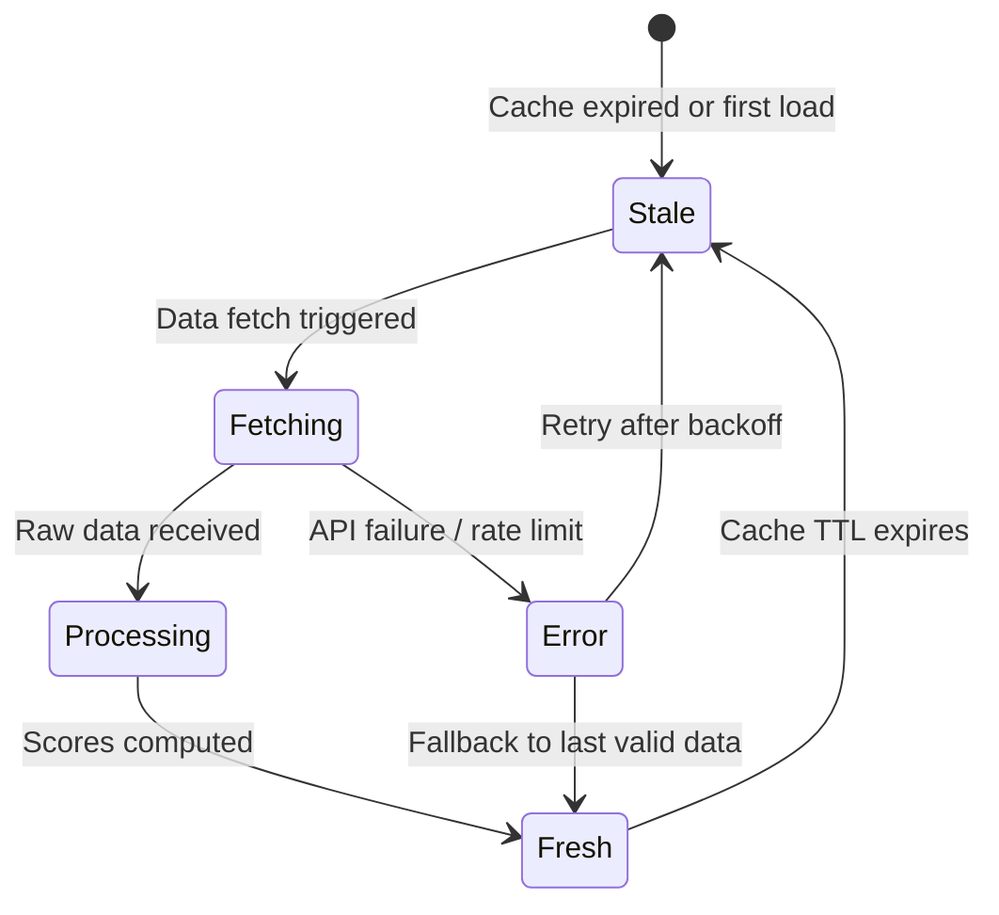
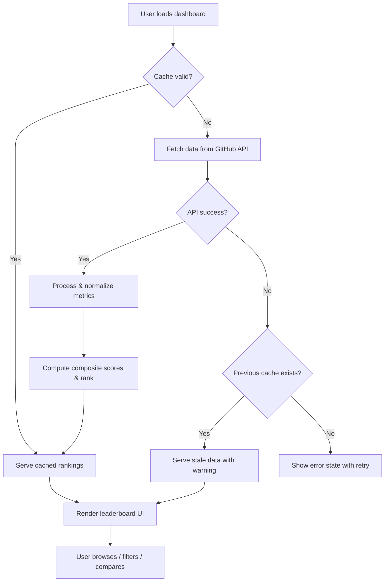

# End-to-End Workflow: Data Fetching → Ranking → Display

---

## 1. Purpose & Scope

**Lifecycle covered**: This workflow describes how raw GitHub data is fetched, processed into language-level metrics, scored into composite rankings, and presented to the end user on the dashboard.

**Start point**: A user loads the dashboard (or cached data expires, triggering a refresh).

**End point**: The user sees a fully rendered leaderboard with ranked programming languages.

**Out of scope**:
- User authentication or session management (the app is public read-only)
- Historical data storage or trend tracking
- Admin-level data management

---

## 2. Actors & System Surfaces

| Actor / Role | System Surface / Module | Responsibilities in Workflow | Permission Level |
|---|---|---|---|
| **End User** | Dashboard UI | Triggers page load, browses rankings, applies filters, compares languages | Read |
| **System (Scheduler)** | Data Fetching Module | Initiates GitHub API requests on page load or cache expiry | Execute |
| **System (Processor)** | Ranking Engine | Normalizes metrics, computes composite scores, sorts rankings | Execute |
| **GitHub API** | External Integration | Provides raw repository, star, fork, and activity data | External |

---

## 3. Core Domain Objects & States

### 3.1 Language Ranking Data

**Purpose**: Represents the aggregated metrics and computed score for a single programming language.

**Lifecycle States**:

**State Definitions**:

| State | Description | Owner | Transition Trigger |
|-------|-------------|-------|--------------------|
| **Stale** | No data or cached data has exceeded TTL | System | Cache TTL expiry or initial load |
| **Fetching** | API requests in flight to GitHub | System (auto) | Stale state detected on request |
| **Processing** | Raw data received, normalization and scoring in progress | System (auto) | Successful API response |
| **Fresh** | Rankings computed, data ready to serve | System (auto) | Processing complete |
| **Error** | GitHub API returned an error or rate limit was hit | System (auto) | API failure; system falls back to last Fresh data if available |

**Business Rules**:
- **Stale → Fetching**: Must only trigger if no other fetch is already in progress (prevent duplicate requests)
- **Error → Fresh**: If previously cached data exists, serve it with a "last updated" indicator
- **Fresh → Stale**: TTL is configurable; default should be short enough to feel "live" but long enough to respect rate limits

---

## 4. Workflow Definition (Primary Flow)

### Step 1: User Loads Dashboard
- **Actor**: End User
- **Surface**: Dashboard UI
- **Trigger**: Browser navigation to the application URL
- **System Behavior**: Check if cached ranking data exists and is within TTL
- **Output**: Decision — serve cache or fetch fresh data
- **Related Epic**: E7 (Responsive Shell)

### Step 2: Fetch Data from GitHub API
- **Actor**: System (Scheduler)
- **Surface**: Data Fetching Module
- **Trigger**: Cache miss or TTL expiry
- **System Behavior**: Issue parallel requests to GitHub REST and GraphQL APIs for language-level metrics (repo counts, stars, forks, commits, PRs). Respect rate limits with request batching and backoff.
- **Output**: Raw metric data per language → state transitions from Stale to Fetching
- **Related Epic**: E1 (Ranking Engine — F1.1, F1.4)

### Step 3: Process & Normalize Metrics
- **Actor**: System (Processor)
- **Surface**: Ranking Engine
- **Trigger**: Successful API response received
- **System Behavior**: Aggregate raw data per language. Normalize each metric to 0-100 scale. Exclude languages with < 100 repositories (BR-003).
- **Output**: Normalized metric set per language → state transitions from Fetching to Processing
- **Related Epic**: E1 (Ranking Engine — F1.2, F1.3)

### Step 4: Compute Composite Scores & Rank
- **Actor**: System (Processor)
- **Surface**: Ranking Engine
- **Trigger**: Normalization complete
- **System Behavior**: Apply weighted formula (BR-002: Repos 25%, Stars 30%, Forks 20%, Activity 25%). Sort languages by composite score. Generate per-metric rankings.
- **Output**: Ordered list of languages with scores → state transitions from Processing to Fresh
- **Related Epic**: E1 (Ranking Engine — F1.2)

### Step 5: Render Leaderboard
- **Actor**: End User (viewer)
- **Surface**: Dashboard UI
- **Trigger**: Fresh data available (from cache or new fetch)
- **System Behavior**: Display ranked language table with position, name, composite score, and individual metrics. Show top-3 visual indicators. Display "last updated" timestamp.
- **Output**: Rendered leaderboard visible to user
- **Related Epic**: E2 (Leaderboard — F2.1, F2.3)

### Step 6: User Interaction
- **Actor**: End User
- **Surface**: Dashboard UI
- **Trigger**: User clicks sort column, enters search, selects filter, or picks languages to compare
- **System Behavior**: Re-sort, filter, or navigate to detail/comparison views. All interactions operate on cached data — no additional API calls.
- **Output**: Updated UI view
- **Related Epic**: E2, E3, E4, E5, E6

---

## 5. Alternative / Edge Flows

### Edge 1: GitHub API Rate Limit Hit
- **Trigger**: API returns 403 with rate limit headers
- **Validation**: Check `X-RateLimit-Remaining` header
- **State Impact**: Fetching → Error
- **Response**: If cached data exists, serve stale data with "Data may be outdated — last updated [timestamp]" banner. If no cache, show error state with retry countdown based on `X-RateLimit-Reset`.
- **Recovery**: Automatic retry after rate limit window resets

### Edge 2: GitHub API Partial Failure
- **Trigger**: Some API requests succeed, others fail (e.g., REST succeeds, GraphQL times out)
- **State Impact**: Fetching → Error (partial)
- **Response**: Display available metrics; show "Some metrics temporarily unavailable" for missing dimensions. Composite score uses available data with adjusted weights.
- **Recovery**: Next cache refresh attempts full fetch

### Edge 3: No Languages Meet Minimum Threshold
- **Trigger**: Somehow all languages fall below 100 repos (extremely unlikely)
- **State Impact**: Processing → Error
- **Response**: Display informational message and lower threshold temporarily
- **Recovery**: Automatic on next fetch cycle

### Edge 4: Extremely Slow API Response
- **Trigger**: GitHub API response takes > 10 seconds
- **State Impact**: Fetching remains in progress
- **Response**: Show skeleton loading state. If > 30 seconds, timeout and fall back to cached data or error state.
- **Recovery**: Next user request retriggers fetch

### Edge 5: Duplicate Fetch Prevention
- **Trigger**: Multiple users load the dashboard simultaneously during a cache miss
- **State Impact**: Only one fetch should execute
- **Response**: Deduplicate concurrent requests — all callers wait for the single in-flight fetch
- **Recovery**: N/A — architecture concern

---

## 6. Cross-Cutting Business Rules & Guardrails

- **Concurrency**: Only one data fetch may be in progress at a time. Concurrent requests must await the active fetch.
- **Idempotency**: Repeated dashboard loads during a valid cache window must return identical results.
- **Data Freshness**: Cached data must display its "last updated" timestamp. Stale data must be visually differentiated from fresh data.
- **Rate Limit Budget**: The system must stay within GitHub's API rate limits at all times. Authenticated requests (5,000/hour) are preferred over unauthenticated (60/hour).
- **Exclusion Rule**: Languages with fewer than 100 public repositories are excluded from all rankings and visualizations (BR-003).
- **Score Determinism**: Given identical input data, the composite score and ranking order must be identical across all renders.
- **Accessibility**: All loading, error, and data states must be communicated to screen readers via ARIA live regions.

---

## 7. Traceability Matrix

| Workflow Area | Step(s) | Capability / Epic / Module | Notes |
|---|---|---|---|
| Data Acquisition | Steps 2 | E1: Ranking Engine (F1.1, F1.4) | GitHub API integration, rate limiting |
| Data Processing | Steps 3-4 | E1: Ranking Engine (F1.2, F1.3) | Normalization, scoring, ranking |
| Primary Display | Step 5 | E2: Leaderboard (F2.1, F2.3) | Table rendering, top-3 indicators |
| User Interaction | Step 6 | E2, E3, E4, E5, E6 | Sort, search, filter, compare, visualize |
| Error Handling | Edge 1-4 | E7: Responsive Shell (F7.4) | Loading states, error recovery |
| Caching | Steps 1, Edge 5 | E1: Ranking Engine (F1.4) | TTL management, deduplication |
