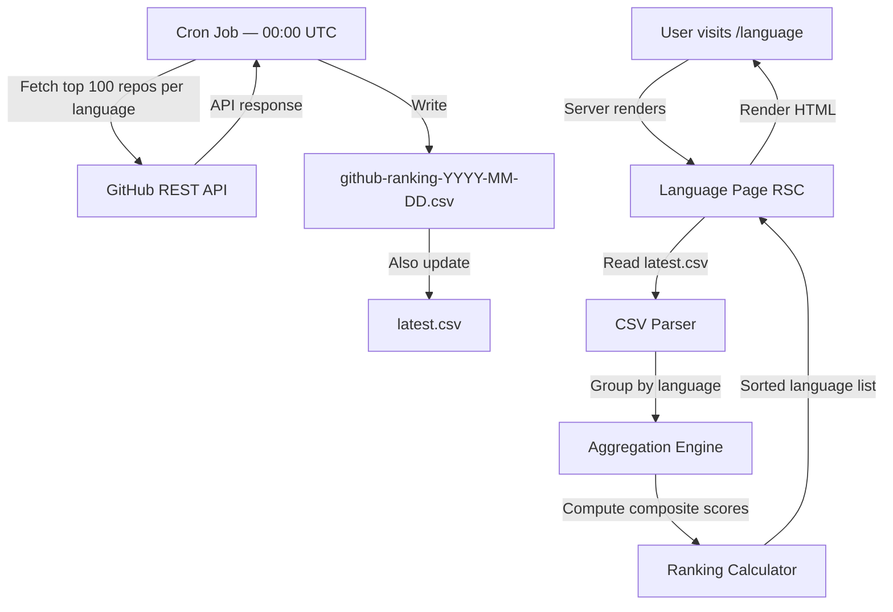
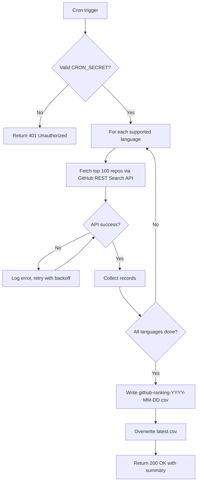

# Feature Specification: Language Ranking

**Feature ID**: F-LR-01  
**Parent Epic**: [E1 — Ranking Engine](../ranking-engine/_epic-e1-ranking-engine.md)  
**Status**: Draft  
**Date**: 2026-05-06  
**Author**: Product Team

---

## 1. Purpose & Scope

### 1.1 Problem Statement

Hiện tại, tính năng xếp hạng ngôn ngữ lập trình hoạt động bằng cách gọi trực tiếp GitHub API cho từng ngôn ngữ mỗi khi người dùng truy cập trang. Điều này dẫn đến:

- Thời gian tải trang chậm vì phải thực hiện nhiều API call song song
- Phụ thuộc vào tính khả dụng và giới hạn rate-limit của GitHub API theo thời gian thực
- Dữ liệu không nhất quán nếu API bị lỗi hoặc timeout trong lúc load

### 1.2 Goal

Xây dựng lại tính năng Language Ranking theo kiến trúc offline-first: dữ liệu được thu thập tự động hàng ngày qua một cron job, lưu vào file CSV, và trang `/language` đọc trực tiếp từ file đó. Trang hiển thị bảng xếp hạng tất cả ngôn ngữ được hỗ trợ cùng với các chỉ số tổng hợp.

Ngoài ra, thêm mục **"Languages"** vào thanh điều hướng (header), đặt bên phải mục "Top Ranking".

### 1.3 Reference

Kiến trúc thu thập và lưu trữ dữ liệu được lấy cảm hứng từ dự án [EvanLi/Github-Ranking](https://github.com/EvanLi/Github-Ranking/tree/master), nơi dữ liệu top 100 repos của mỗi ngôn ngữ được tự động cập nhật hằng ngày và lưu dưới dạng CSV.

---

## 2. User Personas

| Persona | Mô tả | Mục tiêu chính |
|---------|-------|---------------|
| **Developer** | Lập trình viên đang xem xét công nghệ mới | Xem nhanh ngôn ngữ nào phổ biến, có nhiều stars/repos nhất |
| **Engineering Manager** | Quản lý kỹ thuật đưa ra quyết định về stack | Có dữ liệu khách quan để so sánh ngôn ngữ theo nhiều chiều |
| **Tech Educator** | Người xây dựng chương trình học | Hiểu xu hướng ngôn ngữ để cập nhật nội dung giảng dạy |

---

## 3. User Stories

### US-LR-01 — Điều hướng đến trang Language Ranking từ header

> **As a** developer browsing the site,  
> **I want** to see a "Languages" navigation link in the header (to the right of "Top Ranking"),  
> **So that** I can quickly access the language ranking page from anywhere on the site.

#### Acceptance Criteria — AC-LR-01-01

```
Given  I am on any page of the application
When   I view the header navigation bar
Then   I see a "Languages" link positioned to the right of the "Top Ranking" link
```

#### Acceptance Criteria — AC-LR-01-02

```
Given  I click the "Languages" link in the header
When   the navigation completes
Then   I am taken to the /language page
And    the "Languages" nav link appears in an active/highlighted state
```

#### Acceptance Criteria — AC-LR-01-03

```
Given  I am on a mobile viewport (< 768px)
When   I open the navigation menu
Then   the "Languages" link is visible in the mobile menu
And    clicking it navigates to /language
```

---

### US-LR-02 — Xem bảng xếp hạng ngôn ngữ

> **As a** developer,  
> **I want** to see a ranked table of programming languages with key metrics,  
> **So that** I can compare languages side-by-side and identify the most popular ones.

#### Acceptance Criteria — AC-LR-02-01

```
Given  daily CSV data has been successfully written by the cron job
When   I navigate to the /language page
Then   I see a table listing all supported programming languages
And    each row displays: rank position, language name, total repos count, total stars, total forks, last updated date
And    the table is sorted by composite score (descending) by default
```

#### Acceptance Criteria — AC-LR-02-02

```
Given  I am on the /language page
When   the data loads successfully
Then   I see the data's "last updated" timestamp displayed on the page
And    the timestamp corresponds to the most recent cron job run date
```

#### Acceptance Criteria — AC-LR-02-03

```
Given  I am on the /language page
When   the CSV data is unavailable or cannot be read
Then   I see a fallback state with an informative message
And    the page does not crash or show a blank screen
```

---

### US-LR-03 — Sắp xếp bảng theo chỉ số

> **As a** developer,  
> **I want** to sort the language table by any metric column (stars, repos, forks),  
> **So that** I can focus on the dimension most relevant to my decision.

#### Acceptance Criteria — AC-LR-03-01

```
Given  I am viewing the language ranking table
When   I click on a column header (Stars, Repos, or Forks)
Then   the table re-sorts by that column in descending order
And    an indicator shows which column is currently active and the sort direction
```

#### Acceptance Criteria — AC-LR-03-02

```
Given  I have sorted the table by a specific metric
When   I click the same column header again
Then   the sort direction toggles between descending and ascending
```

---

### US-LR-04 — Cron job tự động cập nhật CSV hàng ngày

> **As a** system operator,  
> **I want** the system to automatically fetch fresh GitHub data and write it to a CSV file every day at midnight (00:00 UTC),  
> **So that** the language ranking page always shows up-to-date data without requiring manual intervention.

#### Acceptance Criteria — AC-LR-04-01

```
Given  the cron job is triggered at 00:00 UTC
When   the job runs successfully
Then   it fetches top-100 repositories for each supported language from GitHub
And    it writes the results to a dated CSV file (e.g., github-ranking-YYYY-MM-DD.csv)
And    it updates a "latest" pointer or file so the application knows which CSV to read
```

#### Acceptance Criteria — AC-LR-04-02

```
Given  the cron job completes successfully
When   the CSV file is written
Then   each record in the CSV includes: rank, repo full name (owner/name), stars, forks, language, description, last commit date
And    records are ordered by stars descending within each language group
```

#### Acceptance Criteria — AC-LR-04-03

```
Given  the cron job fails (GitHub API error, network timeout, etc.)
When   the error occurs
Then   the existing CSV file from the previous day is NOT overwritten
And    the error is logged with sufficient detail for diagnosis
And    the /language page continues to serve data from the last successful CSV
```

#### Acceptance Criteria — AC-LR-04-04

```
Given  the cron job runs
When   the GitHub API returns rate-limit errors for some languages
Then   the job retries those languages with exponential backoff
And    it writes partial results for successfully fetched languages
And    missing languages are flagged in the log
```

---

### US-LR-05 — Đọc và xử lý dữ liệu từ CSV

> **As a** system,  
> **I want** the /language page to derive language-level rankings by aggregating repository-level data from the CSV,  
> **So that** the page accurately reflects aggregated GitHub activity per language.

#### Acceptance Criteria — AC-LR-05-01

```
Given  a valid CSV file is available
When   the /language page loads
Then   the system reads the most recent CSV file
And    groups all repository records by language
And    computes per-language aggregates: total repos (count of rows), total stars (sum), total forks (sum)
And    computes a composite score for ranking languages using the existing formula
And    sorts languages by composite score descending
```

#### Acceptance Criteria — AC-LR-05-02

```
Given  the CSV contains records for N languages with up to 100 repos each
When   aggregation is performed
Then   the resulting language table shows exactly N rows, one per language
And    the "Total Repos" figure reflects the count of repos in the CSV for that language (≤ 100)
```

---

### US-LR-06 — Top-3 visual indicators

> **As a** developer,  
> **I want** the top 3 ranked languages to be visually distinguished,  
> **So that** I can immediately identify the dominant languages without reading every row.

#### Acceptance Criteria — AC-LR-06-01

```
Given  the language ranking table is displayed
When  the top 3 languages are shown
Then   rank 1 shows a gold badge/indicator, rank 2 shows silver, rank 3 shows bronze
And    remaining ranks show standard numbering
```

---

## 4. Functional Requirements

| ID | Requirement |
|----|-------------|
| REQ-LR-001 | The header navigation MUST include a "Languages" link positioned after "Top Ranking" |
| REQ-LR-002 | The /language page MUST display a table of all supported programming languages |
| REQ-LR-003 | Each language row MUST display: rank, language name, total repos in CSV, total stars, total forks, last updated date |
| REQ-LR-004 | The table MUST be sortable by: composite score (default), stars, repos, forks |
| REQ-LR-005 | A cron job MUST run daily at 00:00 UTC and write fresh data to a dated CSV file |
| REQ-LR-006 | The cron job MUST fetch top-100 repositories per supported language |
| REQ-LR-007 | Each CSV record MUST contain: rank, repo name, owner, stars, forks, language, description, last commit date |
| REQ-LR-008 | The /language page MUST read data from the most recent successfully written CSV file |
| REQ-LR-009 | The composite score MUST follow the existing formula: 0.25×repos_norm + 0.30×stars_norm + 0.20×forks_norm + 0.25×activity_norm |
| REQ-LR-010 | The page MUST show the date the currently displayed data was last updated |
| REQ-LR-011 | Visual rank indicators (gold/silver/bronze) MUST be applied to ranks 1, 2, 3 |
| REQ-LR-012 | A fallback state MUST display when the CSV cannot be read |
| REQ-LR-013 | The cron job MUST NOT overwrite the previous CSV if the current job fails |

---

## 5. Non-Functional Requirements

| ID | Requirement |
|----|-------------|
| CON-LR-001 | Page initial load time MUST be < 1s (data served from CSV, not live API) |
| CON-LR-002 | The CSV reading and aggregation MUST complete server-side before the page is rendered |
| CON-LR-003 | The page MUST be fully functional with Server Components only (no client-side data fetching for the table) |
| CON-LR-004 | CSV files MUST be stored in the project file system under a dedicated `/data/` directory |
| CON-LR-005 | The cron job endpoint MUST be secured with a secret token to prevent unauthorized triggers |
| SEC-LR-001 | The cron job route MUST validate a `CRON_SECRET` bearer token; requests without a valid token MUST return 401 |
| SEC-LR-002 | CSV file paths MUST NOT be user-controlled; file names are computed server-side from date |
| GUD-LR-001 | Responsive layout MUST work correctly on mobile (< 768px), tablet (768–1024px), and desktop (> 1024px) |
| GUD-LR-002 | Dark mode MUST be supported using existing Tailwind CSS design tokens |

---

## 6. CSV Data Format

### 6.1 File Naming Convention

```
/data/rankings/github-ranking-YYYY-MM-DD.csv
/data/rankings/latest.csv   ← symlink or copy of most recent
```

### 6.2 CSV Schema

Inspired by [EvanLi/Github-Ranking Data format](https://github.com/EvanLi/Github-Ranking/tree/master/Data):

| Column | Type | Description | Example |
|--------|------|-------------|---------|
| `rank` | integer | Rank within the language (1–100) | `1` |
| `item` | string | Repository full name (owner/repo) | `torvalds/linux` |
| `repo_name` | string | Repository short name | `linux` |
| `stars` | integer | Total stars on GitHub | `231965` |
| `forks` | integer | Total forks on GitHub | `62073` |
| `language` | string | Primary language as reported by GitHub | `C` |
| `repo_description` | string | Repository description (may be empty) | `Linux kernel source tree` |
| `last_commit` | ISO-8601 datetime | Timestamp of last commit | `2026-05-05T00:10:25Z` |

### 6.3 Sample Records

```
rank,item,repo_name,stars,forks,language,repo_description,last_commit
1,torvalds/linux,linux,231965,62073,C,Linux kernel source tree,2026-05-05T00:10:25Z
1,facebook/react,react,244835,51002,JavaScript,The library for web and native user interfaces.,2026-05-02T08:50:41Z
1,EbookFoundation/free-programming-books,free-programming-books,387698,66222,Python,📚 Freely available programming books,2026-04-24T13:32:32Z
```

---

## 7. Page Data Flow



---

## 8. Navigation Change

### 8.1 Current Header Nav Order

```
[Logo] [Home] [Top Ranking] [How to Use]
```

### 8.2 Updated Header Nav Order

```
[Logo] [Home] [Top Ranking] [Languages] [How to Use]
```

### 8.3 Link Specification

| Property | Value |
|----------|-------|
| Display label | `Languages` |
| Target path | `/language` |
| Active state | Highlighted when current path starts with `/language` |
| Position | Right of "Top Ranking", left of "How to Use" |
| Mobile | Included in mobile menu drawer |

---

## 9. Cron Job Specification

### 9.1 Schedule

| Property | Value |
|----------|-------|
| Frequency | Once per day |
| Trigger time | 00:00 UTC |
| Trigger mechanism | External cron service (e.g., Vercel Cron, GitHub Actions, or uptime monitoring service) calling the `/api/cron/refresh-rankings` route |

### 9.2 Process Flow



### 9.3 Supported Languages

The same set of languages as the current application supports. The exact list is the source of truth in the data layer.

---

## 10. Language Ranking Table — UI Specification

### 10.1 Columns

| Column | Description | Default Sort |
|--------|-------------|-------------|
| **#** | Rank position with badge for top 3 | — |
| **Language** | Language name | — |
| **Repos** | Count of repos in the latest CSV for this language (out of 100) | Sortable |
| **Total Stars** | Sum of stars across all repos in the CSV for this language | Sortable |
| **Total Forks** | Sum of forks across all repos in the CSV for this language | Sortable |
| **Score** | Composite weighted score (0–100) | Default sort (descending) |
| **Last Updated** | Date of the CSV data (shown once in page header, or per-row if applicable) | — |

### 10.2 Rank Badge Colors

| Rank | Badge style |
|------|-------------|
| 1 | Gold (🥇) |
| 2 | Silver (🥈) |
| 3 | Bronze (🥉) |
| 4+ | Plain number |

### 10.3 Empty / Loading States

| Scenario | UI Behaviour |
|----------|--------------|
| Data loading | Skeleton table rows displayed |
| No CSV available | Amber warning banner: "Ranking data is temporarily unavailable. Please check back later." |
| Partial CSV (some languages missing) | Table shows available languages; a notice warns that data may be incomplete |

---

## 11. Acceptance Test Scenarios

| ID | Scenario | Expected Result |
|----|----------|----------------|
| AT-LR-001 | Navigate to site, observe header | "Languages" link appears after "Top Ranking" |
| AT-LR-002 | Click "Languages" link | Navigates to `/language` page; nav link is active |
| AT-LR-003 | Visit `/language` with valid CSV present | Full ranking table rendered server-side; no spinner visible after initial load |
| AT-LR-004 | Visit `/language` with no CSV present | Amber warning banner shown; no crash |
| AT-LR-005 | Click "Stars" column header | Table re-sorts by total stars descending |
| AT-LR-006 | Click "Stars" column header a second time | Sort toggles to ascending |
| AT-LR-007 | Observe rank 1, 2, 3 rows | Gold, silver, bronze badges are displayed |
| AT-LR-008 | Trigger cron endpoint without `CRON_SECRET` | Returns 401; no CSV written |
| AT-LR-009 | Trigger cron endpoint with valid `CRON_SECRET` | Returns 200; new dated CSV created; `latest.csv` updated |
| AT-LR-010 | Cron job fails mid-run (API error) | Previous `latest.csv` remains intact; error logged |
| AT-LR-011 | View page on mobile viewport | Table is responsive; nav link accessible in mobile menu |
| AT-LR-012 | View page in dark mode | All elements render correctly with dark mode tokens |

---

## 12. Out of Scope

The following items are explicitly NOT part of this feature:

- **Per-language detail page** — clicking a language name may link to an existing detail page, but building or updating that page is out of scope here
- **Historical trend charts** — no time-series visualization of language rank changes over time
- **Manual cron trigger from the UI** — admin-facing trigger; cron runs on schedule or via authorized API call only
- **User-configurable score weights** — composite score weights are fixed in the system
- **Data export** — no CSV/PDF download for users
- **Language search / filter** — the initial table shows all languages; no search bar on the `/language` page in this iteration
- **Real-time data** — the page reflects the most recent daily snapshot, not live GitHub API data
- **More than 100 repos per language** — the cron job fetches exactly the top 100 per language, consistent with the EvanLi reference approach
- **Language icon/logo images** — not included in this iteration
- **Repo-level drill-down from this page** — the language table does not expand to show individual repos
