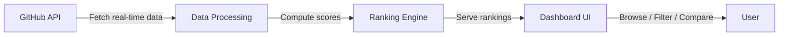

# Product Specification Document
## GitHub Language Rankings Dashboard

---

## 1. Product Overview

### 1.1 Purpose

**Vision**: A modern, public-facing dashboard that ranks programming languages by real-time GitHub activity, giving developers an instant pulse on technology trends.

**Problem**: Developers, engineering managers, and tech educators lack a single, data-driven view that objectively compares programming language popularity and momentum using real GitHub signals. Existing tools (TIOBE, RedMonk, Stack Overflow surveys) rely on surveys, search engine hits, or infrequent annual snapshots — none offer live, activity-based rankings from the world's largest code host.

**Target Audience**:
- Software developers evaluating technology choices
- Engineering managers making team and stack decisions
- Tech educators curating curriculum
- Tech content creators and journalists seeking data-backed insights

**High-Level Workflow**:

### 1.2 In Scope

- Real-time language ranking using live GitHub API data
- Four core metric dimensions: repository count, stars, forks, and activity (commits + PRs)
- Custom composite score combining all signals into a single weighted ranking
- Full dashboard with multiple views: leaderboard, detail cards, comparison tool
- Filtering by time period, metric type, and language subset
- Search for specific languages
- Interactive charts and data visualizations
- Responsive design (mobile, tablet, desktop)
- Dark mode support
- Public read-only access (no authentication required)

### 1.3 Out of Scope

- User accounts, authentication, or personalization
- Historical trend tracking or time-series data storage
- Notifications or alerts
- Language-specific repository listings
- Individual repository rankings
- Data export (CSV, PDF)
- Admin portal or content management
- Public REST/GraphQL API for external consumers
- Mobile native applications

### 1.4 Integrations

| Integration | Purpose |
|-------------|---------|
| **GitHub REST API** | Primary data source for repository counts, star totals, fork counts |
| **GitHub GraphQL API** | Efficient bulk fetching of activity metrics (commits, pull requests) |

---

## 2. Personas & Roles

### 2.1 Developer (Primary)

- **Description**: A working software developer exploring new technologies or validating current stack choices
- **Goals**: Quickly see which languages are trending, compare two or three languages side-by-side, understand momentum beyond hype
- **Pain Points**: Existing rankings feel outdated, biased by surveys, or lack granularity; hard to distinguish "popular" from "actively growing"
- **Key Interactions**: Views leaderboard, filters by metric, compares languages, searches for a specific language

### 2.2 Engineering Manager

- **Description**: A technical leader making decisions about team skills, hiring priorities, and technology investments
- **Goals**: Data-backed evidence for technology decisions, understand which languages have strong community momentum
- **Pain Points**: Needs objective data to present to leadership, not anecdotal evidence
- **Key Interactions**: Views composite rankings, explores detail breakdowns, shares dashboard links with stakeholders

### 2.3 Educator / Content Creator

- **Description**: University instructor, bootcamp facilitator, or tech blogger creating curriculum or content
- **Goals**: Cite authoritative, current data on language popularity; identify emerging languages worth covering
- **Pain Points**: Survey-based rankings are published annually; needs more frequent updates
- **Key Interactions**: Views leaderboard with all metrics visible, checks ranking position changes

---

## 3. Confirmed UX Surfaces

### 3.1 Public Dashboard (Web Application)

**Channels**: Desktop and mobile web browsers

**Primary Workflows**:
1. **Browse Rankings** — Land on the dashboard, see the default composite leaderboard
2. **Filter & Sort** — Change ranking metric (stars, forks, repos, activity, composite), adjust time scope
3. **Search** — Find a specific language by name
4. **Compare** — Select two or more languages for side-by-side metric comparison
5. **Explore Details** — Click a language to see its full metric breakdown

### 3.2 Internal / Admin Surfaces

None — this is a public, read-only application with no admin portal.

---

## 4. Epic List

| # | Epic | Description |
|---|------|-------------|
| E1 | **Ranking Engine** | Fetch, process, and score programming languages from GitHub data |
| E2 | **Leaderboard** | Display ranked list of languages with sortable metrics |
| E3 | **Language Detail** | Show comprehensive metric breakdown for a single language |
| E4 | **Comparison Tool** | Side-by-side comparison of two or more languages |
| E5 | **Search & Filter** | Find and narrow languages by name, metric, or category |
| E6 | **Data Visualization** | Charts and graphs to visualize rankings and distributions |
| E7 | **Responsive Shell** | App layout, navigation, dark mode, responsive design |

---

## 5. Feature List

### E1: Ranking Engine

| Feature | Description | Business Objective | Acceptance Intent |
|---------|-------------|--------------------|-------------------|
| **F1.1 GitHub Data Fetching** | Retrieve language-level repository counts, total stars, forks, and activity metrics from GitHub APIs | Provide accurate, real-time data as the foundation for all rankings | Data is current (within minutes of the last fetch), covers all GitHub-recognized languages |
| **F1.2 Composite Score Calculation** | Compute a weighted composite score combining repos, stars, forks, and activity into a single ranking number | Give users a single "headline" metric for quick comparison | Score reflects a balanced view of popularity and momentum; weights are transparent to users |
| **F1.3 Per-Metric Rankings** | Rank languages independently by each metric dimension (repos, stars, forks, activity) | Allow users to explore beyond the composite view | Each metric produces a distinct, consistent ordering |
| **F1.4 Rate Limit Management** | Handle GitHub API rate limits gracefully with caching and request optimization | Ensure the dashboard remains available without hitting API quotas | System never displays stale data older than a defined threshold; rate limit errors are handled transparently |

### E2: Leaderboard

| Feature | Description | Business Objective | Acceptance Intent |
|---------|-------------|--------------------|-------------------|
| **F2.1 Ranked Language Table** | Display languages in a sortable table with position, name, composite score, and individual metrics | Primary surface for understanding language rankings at a glance | Top 50+ languages visible, sorted by composite score by default |
| **F2.2 Metric Sorting** | Allow users to re-sort the leaderboard by any individual metric column | Let users explore rankings from different angles | Clicking a column header re-sorts; active sort column is visually indicated |
| **F2.3 Ranking Position Indicators** | Show each language's rank position with visual differentiation for top 3 (gold, silver, bronze style) | Make the leaderboard engaging and scannable | Top 3 are visually distinct; all languages show their numeric rank |
| **F2.4 Pagination or Infinite Scroll** | Handle large language lists beyond the initial viewport | Ensure all languages are accessible, not just the top few | Users can access the full list; performance remains smooth |

### E3: Language Detail

| Feature | Description | Business Objective | Acceptance Intent |
|---------|-------------|--------------------|-------------------|
| **F3.1 Detail View** | Full metric breakdown for a selected language: repo count, total stars, total forks, activity score, composite score | Provide depth for users who want to understand a language's data | All metrics displayed clearly with context (e.g., percentiles or relative position) |
| **F3.2 Metric Distribution** | Show how the language's metrics compare to the overall distribution | Help users understand whether a language is an outlier or in the pack | Visual representation of where the language sits relative to average/median |
| **F3.3 Related Languages** | Suggest similar or adjacent languages based on metric profile | Help users discover languages they might not have considered | 3-5 related languages shown with reasoning |

### E4: Comparison Tool

| Feature | Description | Business Objective | Acceptance Intent |
|---------|-------------|--------------------|-------------------|
| **F4.1 Language Selection** | Allow users to select 2-4 languages for comparison | Enable direct head-to-head analysis | Users can add/remove languages; minimum 2 required |
| **F4.2 Side-by-Side Metrics** | Display selected languages' metrics in a comparative layout (table or chart) | Make differences immediately visible | All metric dimensions shown; differences highlighted |
| **F4.3 Radar Chart** | Visualize compared languages on a radar/spider chart across all metric dimensions | Provide an intuitive "shape" comparison | Each language is a distinct line/color; all axes labeled |

### E5: Search & Filter

| Feature | Description | Business Objective | Acceptance Intent |
|---------|-------------|--------------------|-------------------|
| **F5.1 Language Search** | Type-ahead search to find a language by name | Quick access to a specific language without scrolling | Results appear as-you-type; matching is case-insensitive; no results state handled |
| **F5.2 Metric Filter** | Filter the leaderboard to show only languages above a threshold for a given metric | Help users focus on meaningful subsets (e.g., "languages with 10K+ repos") | Filter applies instantly; leaderboard re-ranks within the filtered set |
| **F5.3 Category Tags** | Group languages by paradigm or type (compiled, interpreted, functional, OOP, scripting, systems) | Help users explore languages by characteristic | Tags are pre-defined; selecting a tag filters the leaderboard |

### E6: Data Visualization

| Feature | Description | Business Objective | Acceptance Intent |
|---------|-------------|--------------------|-------------------|
| **F6.1 Bar Chart Rankings** | Horizontal bar chart showing top N languages by selected metric | Visually engaging alternative to the table view | Chart updates when metric selection changes; shows top 10-20 |
| **F6.2 Bubble Chart** | Scatter/bubble chart with configurable axes (e.g., stars vs. forks, bubble size = repos) | Reveal correlations between metrics | Users can select which metric maps to each axis; interactive tooltips |
| **F6.3 Pie/Donut Chart** | Market share visualization showing proportional distribution of a metric across top languages | Communicate relative dominance quickly | Shows top 10 + "Other" grouping; percentages labeled |

### E7: Responsive Shell

| Feature | Description | Business Objective | Acceptance Intent |
|---------|-------------|--------------------|-------------------|
| **F7.1 App Layout & Navigation** | Persistent header with navigation, content area, responsive sidebar or tab navigation | Consistent, professional user experience across all features | Navigation structure is intuitive; current location is indicated |
| **F7.2 Dark Mode** | System-preference-based dark mode with consistent theming | Comfortable viewing in all lighting conditions | Respects OS preference; all components adapt correctly |
| **F7.3 Mobile Responsiveness** | Full functionality on mobile devices with adapted layouts | Reach users on all devices | Tables become cards or scrollable; charts resize; touch-friendly interactions |
| **F7.4 Loading & Error States** | Skeleton loaders, error messages, and retry actions for all data-dependent views | Professional UX even when data is loading or unavailable | Users always know system status; can recover from errors |

---

## 6. Notes for AI-Driven Development

### Behavioral Expectations
- The dashboard must feel fast — data fetching should not block initial page render; use skeleton loading states
- Rankings must be deterministic — given the same input data, the composite score and rankings must be identical
- The composite score formula must be transparent — users should understand how it's calculated (tooltip, info icon, or dedicated section)

### Assumptions
- GitHub's API provides reliable language classification for repositories
- The set of programming languages recognized by GitHub is the canonical list
- Rate limits (5,000 requests/hour for authenticated, 60/hour unauthenticated) are the primary constraint
- Languages with negligible activity (e.g., <100 repos) may be excluded from rankings to reduce noise

### Business Rules
- **BR-001**: Composite score must normalize each metric to a 0-100 scale before applying weights
- **BR-002**: Default composite weights: Repositories (25%), Stars (30%), Forks (20%), Activity (25%) — displayed to users
- **BR-003**: Languages with fewer than 100 public repositories on GitHub are excluded from rankings
- **BR-004**: "Activity" is defined as the sum of commits and merged pull requests within the measured period
- **BR-005**: When GitHub API is temporarily unavailable, the system must display the most recently fetched data with a "last updated" timestamp

### Ambiguity Risks
- GitHub may change API rate limits, response formats, or language classification — the system should degrade gracefully
- Some languages share names with non-programming concepts (e.g., "Go") — rely on GitHub's own language detection
- Fork counts can be inflated by automated forks — consider whether to discount or note this

### Non-Functional Business Expectations
- **Performance**: Dashboard should load within 2 seconds on a standard broadband connection
- **Availability**: Being a read-only informational tool, brief downtime is acceptable; stale data is preferable to no data
- **Scalability**: Should support thousands of concurrent readers without degradation
- **Accessibility**: Must meet WCAG 2.1 AA standards

---

## 7. Business Priority

### Epic Priority

| Epic | Priority | Justification | Dependencies |
|------|----------|---------------|--------------|
| E1: Ranking Engine | **P0 — Critical** | Foundation for all other features; no value without data | None |
| E7: Responsive Shell | **P0 — Critical** | App structure required before any features can be rendered | None |
| E2: Leaderboard | **P0 — Critical** | Core user-facing value; the primary reason users visit | E1, E7 |
| E5: Search & Filter | **P1 — High** | Essential for usability when language list is long | E2 |
| E3: Language Detail | **P1 — High** | Provides depth that differentiates from simple lists | E1, E2 |
| E6: Data Visualization | **P1 — High** | Visual engagement drives sharing and return visits | E1, E2 |
| E4: Comparison Tool | **P2 — Medium** | Power-user feature; high value but narrower audience | E1, E3 |

### Feature Priority Within P0 Epics

| Feature | Priority | Rationale |
|---------|----------|-----------|
| F1.1 GitHub Data Fetching | P0 | No data = no product |
| F1.2 Composite Score | P0 | Default ranking requires this |
| F1.3 Per-Metric Rankings | P0 | Core sorting capability |
| F1.4 Rate Limit Management | P0 | Operational necessity |
| F2.1 Ranked Language Table | P0 | Primary UI surface |
| F2.2 Metric Sorting | P0 | Core interaction |
| F2.3 Ranking Position Indicators | P1 | Visual polish |
| F2.4 Pagination | P1 | Needed only if >50 languages |
| F7.1 App Layout & Navigation | P0 | Structural requirement |
| F7.2 Dark Mode | P1 | Expected modern feature |
| F7.3 Mobile Responsiveness | P0 | Significant mobile traffic expected |
| F7.4 Loading & Error States | P0 | Professional UX baseline |
